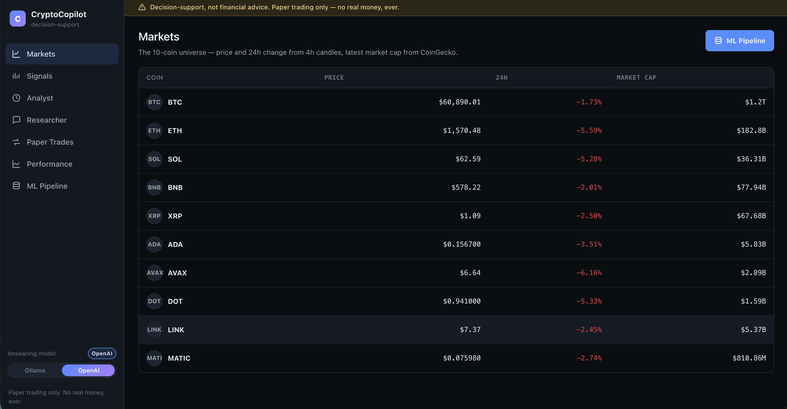
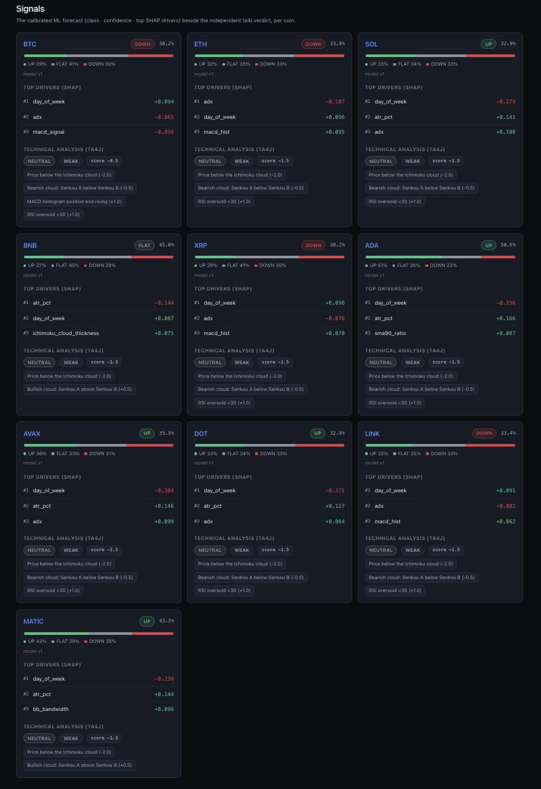
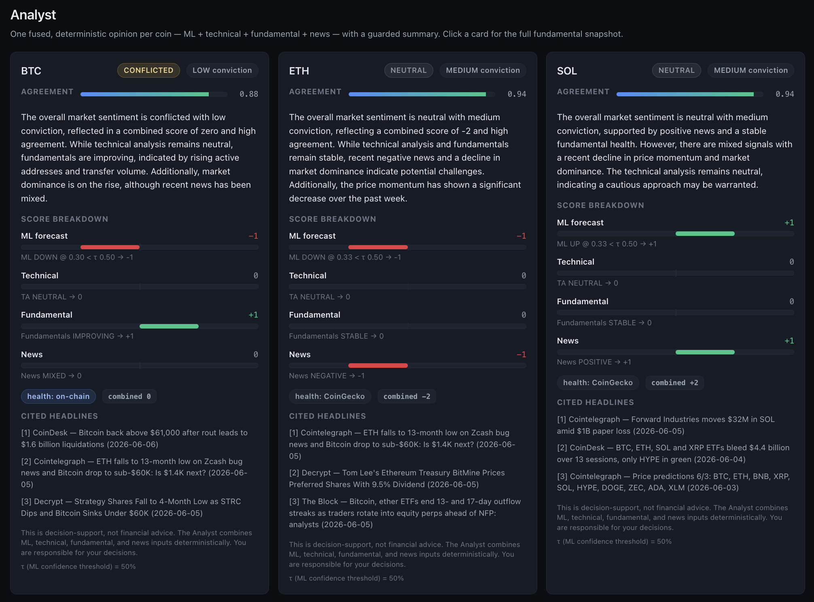
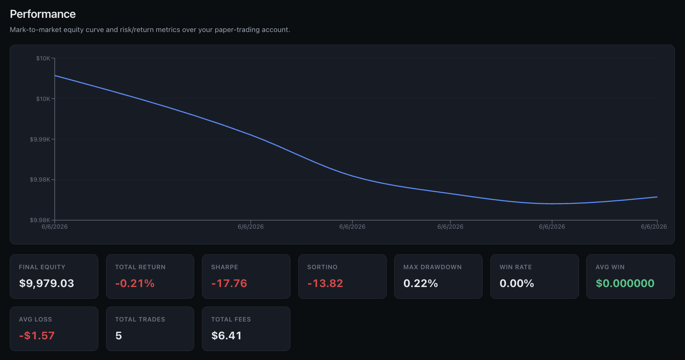

# CryptoCopilot — Polyglot Edition

[](https://github.com/hzajkani/cryptocopilot/actions/workflows/ci.yml)
&nbsp;
&nbsp;

A personal, **paper-only** crypto trading assistant, built as a **polyglot system**: a Python
data + ML service, a Java/Spring Boot application service, and a React frontend — four Docker
containers around one shared **Postgres + pgvector** database. It fuses four perspectives on each of
10 coins — an **ML** direction signal, a deterministic **technical-analysis** verdict, a
**fundamental** snapshot, and a cited **RAG** chat over news + on-chain + a knowledge base — into one
explainable **Analyst** opinion, and lets you act with a **paper trade**.

> ⚠️ **Decision-support, not financial advice. Paper trading only — no real money, ever.**

It's deliberately a **portfolio piece**: a production-grade Spring Boot fintech backend (Spring AI,
ta4j, a paper-trading engine, a deterministic Analyst), ML kept where Python is strongest (XGBoost,
isotonic calibration, SHAP), and a clean two-language boundary that is **just a shared database** —
no RPC, no shared model files. The numbers below are **honest** (an ML macro-F1 of 0.375 is presented
as the deliberate, data-limited result it is) — see [Honest scope](#honest-scope).

## Architecture — five containers, one shared database

```
                        ┌──────────────────────────────┐
   browser  ─────────►  │  frontend  (React + nginx)   │
                        └───────────────┬──────────────┘
                                        │ REST / JSON  (same-origin; nginx proxies /api)
                                        ▼
                        ┌──────────────────────────────┐
                        │  backend  (Spring Boot)      │   ◄── MODULAR MONOLITH
                        │  ta4j · Spring AI · trading  │       (ONE container, many
                        │  analyst · REST API          │        internal modules)
                        └──────┬──────────────────┬────┘
                               │ JDBC             │ HTTP  /api/ml/* → ingest·train·predict
                               ▼                  ▼
       ┌──────────────►  ┌─────────────────┐   ┌──────────────────────────────┐
       │ (writes preds,  │  db  (Postgres  │   │  ml-api  (Python · FastAPI)  │ ◄─ ON-DEMAND
       │  raw data)      │  16 + pgvector) │   │  triggers the same jobs      │    TRIGGERS
       │                 └─────────────────┘   └───────────────┬──────────────┘
       │                          ▲                            │ (same code,
┌──────┴───────────────────────┐  │ JDBC reads                 │  shared model dir)
│  ml  (Python)                │  │                            ▼
│  ingestion · XGBoost · SHAP  │  └──────────────────  writes predictions / raw data
└──────────────────────────────┘   ◄── BATCH WORKER: wakes on a schedule, writes, sleeps.
```

The **database is the polyglot boundary**: Python writes its tables, Java reads them — no RPC, no
shared model files. Each table has exactly one writer. The backend is a **modular monolith**, not
microservices. The ML pipeline runs two ways over the *same* code: the **`ml`** container is a
scheduled **batch worker**, and the **`ml-api`** container puts a thin **FastAPI** in front of the
same ingest/train/predict jobs so they can be launched on demand from the backend (`/api/ml/*`) and
the **ML Pipeline** page in the UI. The full rationale is one page:
**[`docs/ARCHITECTURE.md`](docs/ARCHITECTURE.md)**.

## Screenshots

> _Placeholders — run `make demo`, then drop PNGs into [`docs/img/`](docs/img/) (filenames listed there)._

| Markets | Signals | Analyst |
|---|---|---|
|  |  |  |

| Researcher (chat) | Performance |
|---|---|
|  |  |

## Quickstart — `make demo`

**Prerequisites:** Docker + Docker Compose. Two free API keys:
[CoinGecko Demo](https://www.coingecko.com/en/api) and [Etherscan](https://etherscan.io/apis).
**Optional:** a local [Ollama](docs/OLLAMA_SETUP.md) for the cited chat + LLM-phrased Analyst
summaries (everything still works without it — see [below](#ollama-up-or-down)).

```bash
# 1. Configure secrets (cp -n will NOT overwrite an existing .env)
cp -n .env.example .env
$EDITOR .env          # add COINGECKO_API_KEY + ETHERSCAN_API_KEY

# 2. One command: up + ingest + train + predict + reindex + seed a few paper trades
make demo
```

`make demo` brings up `db` + `backend` + `frontend` (waiting on healthchecks), ingests the five
public data sources, trains the calibrated model, writes predictions + SHAP drivers, builds the RAG
index, and seeds a handful of illustrative paper trades — so **Markets, Signals, Analyst, Chat, Paper
Trades and Performance are all non-empty** on first look.

> ⏱️ **One-time cost:** the ingest + train steps take a few minutes (a network crawl + a model fit).
> Subsequent `docker compose up` is instant. Run `make help` to see all targets.

When it finishes:

| | URL |
|---|---|
| **Frontend** | <http://localhost:3000> |
| **API docs (Swagger UI)** | <http://localhost:8080/swagger-ui.html> |
| **Health** | <http://localhost:8080/actuator/health> |

### Ollama up or down

The Researcher chat and the LLM-phrased Analyst summary use a **free local Ollama**
(`llama3.2:3b` + `nomic-embed-text`). The demo works **either way**:

- **Ollama up** → chat returns **cited** answers; the Analyst summary is LLM-phrased (behind a
  numeric hallucination guard); `make demo` builds the RAG index.
- **Ollama down** → chat **refuses cleanly** (it can't embed the query); the Analyst falls back to a
  **deterministic template** summary; the RAG-index step is skipped (not fatal). Markets, Signals,
  Analyst, Paper Trades and Performance are fully populated regardless.

To enable the rich path later: install Ollama + pull the two models ([`docs/OLLAMA_SETUP.md`](docs/OLLAMA_SETUP.md)),
then `make reindex`.

## Manual setup (the individual commands)

`make demo` is just this sequence — run the pieces by hand if you prefer:

```bash
cp -n .env.example .env && $EDITOR .env        # secrets
docker compose up -d --build --wait db backend frontend ml-api

docker compose run --rm ml python -m ml.ingest.run_all   # FETCH  → ohlcv/market_meta/news/onchain/fundamentals
docker compose run --rm ml python -m ml.train            # TRAIN  → ml/models/v1/ (+ reports)
docker compose run --rm ml python -m ml.predict          # PREDICT→ predictions + prediction_drivers

curl -X POST localhost:8080/api/rag/reindex              # build the pgvector index (needs Ollama)
bash scripts/seed_demo_trades.sh                          # seed a few illustrative paper trades
```

The same three jobs can be launched **on demand** instead of by `compose run` — from the
**ML Pipeline** page in the UI (a button each for ingest / train / predict, with live status and
results), or via the backend proxy. They run as background jobs; the `POST` returns a job to poll:

```bash
JOB=$(curl -fsS -X POST localhost:8080/api/ml/ingest | python -c 'import sys,json;print(json.load(sys.stdin)["id"])')
curl -fsS localhost:8080/api/ml/jobs/$JOB                 # poll: state → running | success | error
curl -fsS localhost:8080/api/ml/status                    # row counts · model card · latest predictions
# Swagger for the Python service itself: http://localhost:8000/docs
```

The `ml` container's default command is an **APScheduler** worker (daily ingest + a predict every
4h); the sibling **`ml-api`** container serves the on-demand FastAPI over the *same* code. Training
stays off the schedule. `ml/models/`, `ml/data/`, `ml/reports/` are **bind-mounted** and shared by
both, so a model trained by either path is visible to the next `predict` and inspectable on the host.

## Honest scope

The point is production-grade polyglot **engineering**, not beating the market. These results are
presented as the deliberate, documented outcomes they are (PROJECT.md §9):

| Layer | Result | Note |
|---|---|---|
| **ML** 3-class direction | macro **F1 0.375** · **AUC 0.578** · **Brier 0.606** | F1 is below the 0.40 stretch gate — a **data-limited** ceiling (~2y of OHLCV), investigated (not leakage, not the decision rule). AUC + Brier pass. |
| **RAG** retrieval | **recall@8 = 0.90** · 100% citation rate | strict grounding; refuses out-of-corpus questions + trading advice with fixed phrases. ≈ €0 (local Ollama). |
| **Paper-trading** backtest | default **0 trades**; TA proxy **Sharpe −1.20** | the default needs a historical ML series that doesn't exist (single-snapshot ML); the TA proxy is an honest fee-and-regime-driven ≤0. |

The intelligence layer is documented in three interview-ready cards:
**[Model card](docs/MODEL_CARD.md)** · **[RAG card](docs/RAG_CARD.md)** · **[Analyst card](docs/ANALYST_CARD.md)**.

**Hard rules (never broken):** no real money, ever — paper only. Crypto only; no shorts, no leverage.
The Analyst may only synthesise facts present in its four inputs (a hallucination guard falls back to
a deterministic template). A persistent **decision-support, not financial advice** disclaimer on every
page. Multi-source data by design; log-and-skip on any source failure.

## Data sources

All sources are public and free. If a source goes paid or down, the pipeline **logs and skips** it —
it never crashes (PROJECT.md §9).

| Source | Used for | Auth |
|---|---|---|
| Binance public API | OHLCV (1h / 4h / 1d, ~2 years) | none |
| CoinGecko Demo | market cap/supply + community + developer + market data (all 10 coins) | free key, 10k/mo, 30/min |
| RSS (CoinDesk, Cointelegraph, Decrypt, The Block, Bitcoin Magazine) | news, 180-day rolling window | none |
| Blockchain.com Charts | BTC on-chain | none |
| Etherscan | ETH on-chain | free key, 5/sec, 100k/day |
| Curated KB | coin mechanism / tokenomics markdown (Stage 4) | — |

**Assets (10):** BTC, ETH, SOL, BNB, XRP, ADA, AVAX, DOT, LINK, MATIC/POL. (MATIC was rebranded POL
in late 2024; the OHLCV loader stitches `MATIC/USDT` and `POL/USDT` under the `MATIC` symbol.)

## Table ownership — exactly one writer per table

The shared DB stays clean by **strict table ownership** (PROJECT.md §3). Java never writes Python's
tables; Python never writes Java's. The frontend holds no business logic — it only reads backend REST.

| Container | Owns / writes | Reads |
|---|---|---|
| **ml** (Python) | `ohlcv`, `market_meta`, `news`, `onchain`, `fundamentals`, `predictions`, `prediction_drivers` | its own tables |
| **backend** (Java) | `account_state`, `positions`, `trades`, `orders`, the Spring-AI `vector_store` | all of ml's tables (read-only) |
| **frontend** (React) | — | backend REST only |

## The build story — 7 stages, one tag each

Built in 7 stages across 3 phases; each closes with a `STATE.md` update and a git tag. The
[`PROJECT.md`](PROJECT.md) frozen spec and [`STATE.md`](STATE.md) living handoff tell the full story.

| Stage | Phase | Deliverable | Tag |
|---|---|---|---|
| 1 | A · data+ML | Monorepo + compose + Postgres/pgvector + schema + all ingestion | [`stage-1-done`](https://github.com/hzajkani/cryptocopilot/tree/stage-1-done) |
| 2 | A · data+ML | XGBoost + isotonic calibration + SHAP → `predictions` (batch worker) | [`stage-2-done`](https://github.com/hzajkani/cryptocopilot/tree/stage-2-done) |
| 3 | B · backend | Spring Boot REST over the data + ta4j TA verdict | [`stage-3-done`](https://github.com/hzajkani/cryptocopilot/tree/stage-3-done) |
| 4 | B · backend | RAG (Spring AI + pgvector): indexed corpus, cited grounded chat | [`stage-4-done`](https://github.com/hzajkani/cryptocopilot/tree/stage-4-done) |
| 5 | B · backend | Paper-trading engine + deterministic Analyst aggregator | [`stage-5-done`](https://github.com/hzajkani/cryptocopilot/tree/stage-5-done) |
| 6 | C · frontend | React app (Markets, Signals, Analyst, Chat, Paper Trades, Performance) | [`stage-6-done`](https://github.com/hzajkani/cryptocopilot/tree/stage-6-done) |
| 7 | D · polish | Demo mode, README, cards, Docker hardening, CI, **v1.0** | [`v1.0`](https://github.com/hzajkani/cryptocopilot/releases/tag/v1.0) |

## Tests

```bash
# ml (Python) — offline suite (skip the Binance network test)
docker compose run --rm ml pytest -q -m "not network"

# backend (Java) — offline suite. The repository slice (OhlcvRepositoryTest) needs the running
# db with ingested data; exclude it when the stack is down:
cd backend && mvn -q test -Dtest='!OhlcvRepositoryTest'   # or plain `mvn test` with `db` up + seeded

# frontend (TypeScript/React)
cd frontend && npm ci && npm run build && npm test

# gated live runs (need the db; RAG also needs a local Ollama):
RAG_LIVE=1      mvn -Dtest=RagLiveIT test        # RAG retrieval eval   → reports/retrieval_eval.md
BACKTEST_LIVE=1 mvn -Dtest=BacktestLiveIT test   # real-window backtest → reports/backtest_strategy_v1.md
```

CI (`.github/workflows/ci.yml`) runs the three offline suites on every push (the badge above).

## Repo layout

```
cryptocopilot/
├── PROJECT.md            # frozen spec (do not modify during the build)
├── STATE.md              # living handoff between stages — current status + row counts
├── README.md             # this file
├── Makefile              # `make demo`, plus up/down/ingest/train/predict/reindex/seed/test
├── docker-compose.yml    # db + ml + backend + frontend (healthchecks + depends_on)
├── scripts/              # demo.sh (one-command demo) + seed_demo_trades.sh
├── docs/                 # ARCHITECTURE.md + MODEL_CARD / RAG_CARD / ANALYST_CARD + OLLAMA_SETUP + img/
├── db/init.sql           # the shared schema contract (PROJECT.md §5)
├── reports/              # retrieval_eval.md, backtest_strategy_v1.md
├── ml/                   # Python data + ML service (ingest, features, modelling, predict, scheduler)
└── backend/             # Java/Spring Boot service (data, ta, rag, analyst, trading, web)
    └── src/main/java/com/cryptocopilot/
        ├── controller/ service/ entity/ repository/ dto/   # market data + ta4j TA verdict (Stage 3)
        ├── rag/          # the Researcher: indexer, retriever, grounded generator (Stage 4)
        ├── analyst/      # FundamentalSnapshot + deterministic Analyst + guarded summary (Stage 5)
        ├── trading/      # long-only paper-trading engine + backtest (Stage 5)
        └── web/          # global exception handler → clean JSON errors (Stage 7)
```

---

*CryptoCopilot is a personal project and a portfolio piece. **Decision-support, not financial advice;
paper trading only.***
